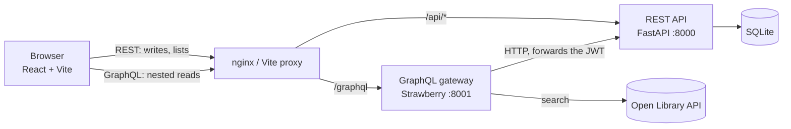

# 📚 ReadTrack

A book-tracking app: search books, put them on your shelf, track reading progress, and write reviews.

It is built to show **two API styles working together**: a **REST** API that owns the data and the rules,
and a **GraphQL** gateway on top of it that serves nested reads in a single request and combines
our data with an external API (Open Library). A React frontend uses both.

## Architecture



| Piece | Responsibility |
|---|---|
| **REST API** (`rest-api/`) | The system of record. Authentication (JWT), validation, ownership rules, the database. |
| **GraphQL gateway** (`graphql-api/`) | No database. Every resolver calls the REST API, so rules live in one place. Adds DataLoader batching and the Open Library integration. |
| **Frontend** (`frontend/`) | Reads with GraphQL where data is nested, writes with REST. Includes a live **Network panel** that labels each request REST or GraphQL. |

## Features
- Register and log in (bcrypt password hashes, JWT access tokens)
- Authors, books, filtering, sorting, pagination, average ratings
- Personal shelf (to-read / reading / finished) with page progress, and reading stats
- Reviews (one per user per book, only the owner can edit or delete)
- Search Open Library and import a book into the catalog with one click
- GraphQL queries, mutations, and a batched (DataLoader) relationship layer

## Tech stack
Python 3.13, FastAPI, SQLAlchemy 2, Pydantic 2, PyJWT, bcrypt, Strawberry GraphQL, httpx,
React 19, Vite, React Router, pytest, Docker Compose, nginx, GitHub Actions.

## Deploy to Render (free tier)

One Blueprint (`render.yaml`) deploys all three services plus a Postgres database.

1. Push this repo to your own GitHub account (it must be a repo Render can see).
2. On [render.com](https://dashboard.render.com): **New** → **Blueprint** → pick this repo → **Apply**.
   Render reads `render.yaml` and creates four resources: `readtrack-db` (Postgres), `readtrack-rest-api`,
   `readtrack-graphql-api`, and `readtrack-frontend`.
3. Wait for all three services to show **Live** (the first build takes a few minutes each).
4. Open the URL Render gives `readtrack-frontend`.

**If a name was already taken:** `render.yaml` assumes each service gets the exact URL
`https://<service-name>.onrender.com`. If Render had to rename one (you'll see this on its page,
e.g. `readtrack-rest-api-a1b2`), some other services still have the old URL baked in. Fix it by
updating the environment variable that points at it, then manually redeploying the services you changed:
   - Renamed `readtrack-rest-api` → update `REST_API_URL` on `readtrack-graphql-api` and
     `VITE_REST_URL` on `readtrack-frontend`.
   - Renamed `readtrack-graphql-api` → update `VITE_GRAPHQL_URL` on `readtrack-frontend`.
   - Renamed `readtrack-frontend` → update `CORS_ORIGINS` on both `readtrack-rest-api` and
     `readtrack-graphql-api`.
   `VITE_*` variables are baked in at **build time**, so `readtrack-frontend` needs a fresh deploy
   (not just a restart) after changing one.

**Free-tier behavior to expect** (this is Render, not a bug in the app):
   - Each free web service **spins down after 15 minutes idle** and takes about a minute to wake up
     on the next request — the first click after a quiet period will feel slow.
   - The free Postgres database **expires 30 days after creation**. Before then, either upgrade it
     or note that your data will need re-entering after it's recreated.
   - 750 free instance-hours are shared per month across your free services.

**This has not been run against a live Render account** (no account was available while building this),
though the individual pieces were verified locally: the Postgres connection-string rewrite in
`rest-api/app/database.py`, CORS between three different `localhost` ports standing in for three Render
origins, and the `render.yaml` syntax against Render's own docs. Treat the first deploy as the real test,
and see [Known limitations](#known-limitations-deliberate-scope-cuts) below.

## Run it with Docker
```bash
cp .env.example .env        # then set SECRET_KEY inside (the file explains how)
docker compose up --build
```
Open http://localhost:8080. Also exposed for exploring: REST docs at http://localhost:8000/docs and
GraphiQL at http://localhost:8001/graphql.

## Run it locally (three terminals)
```bash
# 1. REST API
cd rest-api
python -m venv .venv
.venv\Scripts\pip install -r requirements.txt          # macOS/Linux: .venv/bin/pip
.venv\Scripts\python -m uvicorn app.main:app --port 8000

# 2. GraphQL gateway
cd graphql-api
python -m venv .venv
.venv\Scripts\pip install -r requirements.txt
.venv\Scripts\python -m uvicorn app.main:app --port 8001

# 3. Frontend
cd frontend
npm install
npm run dev                                             # http://localhost:5173
```
Set `SECRET_KEY` in the environment for the REST API outside development (a development-only default is used otherwise).

## A tour of the APIs

**REST** (interactive docs at `/docs`)

| | |
|---|---|
| `POST /auth/register`, `POST /auth/login` | Create an account, get a JWT |
| `GET /books?genre=&search=&sort=-avg_rating&page=1&limit=10` | Filter, sort, paginate |
| `GET/POST /books/{id}/reviews`, `PATCH/DELETE /reviews/{id}` | Reviews (owner-only edits) |
| `GET /shelf`, `PUT /shelf/{book_id}`, `PATCH /shelf/{book_id}/progress` | Personal shelf |
| `GET /users/me/stats` | Aggregates computed by the database |

**GraphQL**
```graphql
# The whole dashboard in one request
{
  me {
    stats { finished pagesRead }
    shelf(status: READING) { currentPage book { title avgRating author { name } } }
  }
}

# One field, two APIs: Open Library results merged with our ratings
{ searchBooks(text: "dune", limit: 5) { title authors inCatalog { avgRating reviewCount } } }
```

## REST vs GraphQL: what was measured

| Scenario | Result |
|---|---|
| Book list with authors, 10 books, naive resolvers | **11** REST calls behind one GraphQL request |
| Same query after DataLoader batching | **2** REST calls (82% fewer; the gap grows with page size) |
| `searchBooks` (10 results) | 3 calls total: 1 Open Library, 1 REST for all titles, 1 batched authors lookup |
| Dashboard | **1** GraphQL request from the browser (5 REST calls behind it, all made server-side). Plain REST from the browser would need 3 requests plus one per shelved book and one per author. |

The measurement method and the remaining un-batched case (`Book.reviews`) are written up in
[graphql-api/NOTES.md](graphql-api/NOTES.md).

## Testing
```bash
cd rest-api    && .venv\Scripts\python -m pytest --cov=app     # 36 tests, 98% coverage
cd graphql-api && .venv\Scripts\python -m pytest               # 23 tests, no network needed
cd frontend    && npm run build
```
- REST tests run against a fresh in-memory database per test (dependency override).
- Gateway tests fake both the REST API and Open Library with `httpx.MockTransport`, and assert
  the exact number and shape of outgoing calls.
- GitHub Actions runs all three on every push (`.github/workflows/ci.yml`).

## Design decisions
- **REST owns the rules; GraphQL is a gateway.** Validation, auth and ownership are implemented once.
  GraphQL forwards the caller's `Authorization` header and turns REST errors into GraphQL errors.
- **Login uses the OAuth2 password form** (`username` + `password`, form-encoded) so the Authorize button in `/docs` works.
- **One generic error for bad logins** so the endpoint cannot be used to discover which emails have accounts.
- **Deleting is conservative:** authors with books and books with reviews or shelf entries return `409` instead of leaving orphans.
- **Whitelisted sorting** (`sort=` only accepts known columns) instead of passing user input to the database.
- **Dev proxy / nginx / Render** give the browser one origin per environment where possible (dev, Docker);
  on Render the three services are separate origins, so `CORSMiddleware` explicitly allows the frontend's
  origin instead (see `CORS_ORIGINS` in both Python services' `main.py`).
- **One database file works two ways.** `rest-api/app/database.py` rewrites a Postgres URL's scheme
  (`postgres://` → `postgresql+psycopg://`) and only passes SQLite's `check_same_thread` flag when the
  URL is actually SQLite, so the same code runs against a local file or Render's Postgres.

## Known limitations (deliberate scope cuts)
- No migrations (Alembic would be the next step): both SQLite and Postgres use plain `create_all`,
  so a data model change means dropping the database (deleting the file locally, or recreating the
  Render Postgres instance).
- Access tokens only (60 minutes, no refresh tokens) and stored in `localStorage`; the trade-off is documented in `frontend/src/api/token.js`.
- `Book.reviews` is still one REST call per book (needs a bulk reviews endpoint to batch).
- No GraphQL subscriptions, query-depth limits or rate limiting.
- Frontend has no automated tests yet, and editing or deleting a review is only available through the REST API.
- The Docker setup has not been run on the machine it was written on (Docker was not installed there); the Python and Node builds it relies on were verified separately.

## Project layout and learning notes
```
readtrack/
├── rest-api/       FastAPI app, tests, NOTES.md (phases 1-4)
├── graphql-api/    Strawberry gateway, tests, NOTES.md (phases 5-7)
├── frontend/       React app, NOTES.md (phase 8)
├── docker-compose.yml, .env.example, .github/workflows/ci.yml   (phase 9)
├── render.yaml     Render Blueprint: deploys everything above in one click (phase 10)
```
Every file is commented to explain the concept it demonstrates. Each `NOTES.md` has a suggested reading order.
